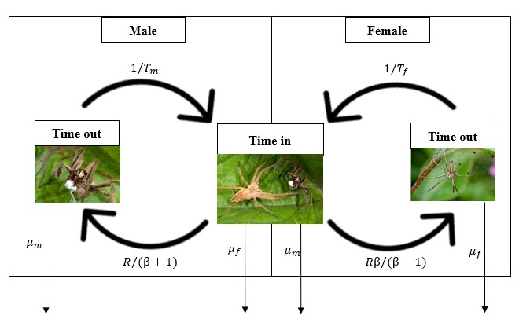

```{r, echo = FALSE}
library("knitr")
calc_beta <- function(M = 1, TF = 1, TM = 1){
  term1 <-   (M * (TF - TM))^2;
  term2 <-   (M * (TF - TM))^4;
  term3 <- 4*(M * (TF - TM))^2;
  ttrm  <- (term2 + term3)^(1/2);
  sol1  <- 0.5 * (term1 - ttrm) + 1;
  sol2  <- 0.5 * (term1 + ttrm) + 1;
  if(TF > TM){
    beta = max(c(sol1, sol2));
  }else{
    beta = min(c(sol1, sol2));
  }
  return(list = c(beta = beta, solution1 = sol1, solution2 = sol2));
}
get_beta <- function(M = 1, TF = 1, TM = 1){
  betas <- rep(NA, length = length(TM));
  for(i in 1:length(TM)){
    betas[i] <- calc_beta(M = M, TF = TF, TM = TM[i])[[1]];
  }
  return(betas);
}
PrGf <- function(Tm, a1){
  vals <- 1 - exp(-(1/a1)*Tm);
  return(vals);
}
PrFf <- function(Tm, a1, a2 = Inf){
  vals <- (1 - exp(-(1/a2)*Tm)) * exp(-(1/a1)*Tm);
  return(vals);
}
dWdT <- function(gamma, Tm, beta = 1, M = 100, a1 = 1){
  num1 <- gamma * (M*M + ((M*M*Tm + M*sqrt(beta))/a1) );
  dem1 <- exp((1/a1)*Tm);
  num2 <- (num1 / dem1) - M*M*(1 + gamma);
  den2 <- ((Tm * M) + sqrt(beta))^2;
  val  <- num2/den2;
  return(val);
}
dWdT_check <- function(gamma, beta = 1, M = 100, a1 = 1){
  term1 <- (gamma * M) / (a1*sqrt(beta));
  term2 <- (M*M) / beta;
  val   <- term1 - term2;
  return(val);
}
recursive_b <- function(B, D, Tf, Tm, crit = 0.0001, maxit = 9999){
  conv <- 1;
  iter <- 0;
  while(conv > crit & iter < maxit){
    Fe   <- D * (B / (1 + B));
    Me   <- (1 + B) / D;
    Bn   <- (Me / (Tm + Me)) / (Fe / (Tf + Fe));
    iter <- iter + 1;
    conv <- abs(Bn - B);
    B    <- Bn;
  }
  return(list(B = B, conv = conv, iter = iter));
}
calc_beta <- function(M = 1, TF = 1, TM = 1){
  vals <- recursive_b(B = 1, D = M, Tf = TF, Tm = TM);
  beta <- vals$B
  sol1 <- vals$conv;
  sol2 <- vals$iter;
  return(list = c(beta = beta, solution1 = sol1, solution2 = sol2));
}
get_beta <- function(M = 1, TF = 1, TM = 1){
  betas <- rep(NA, length = length(TM));
  for(i in 1:length(TM)){
    betas[i] <- calc_beta(M = M, TF = TF, TM = TM[i])[[1]];
  }
  return(betas);
}
gamma_m <- function(R = 1, beta = 1, alpha = 1/16, TF = 2){
  return(alpha * (R / (beta + 1)));
}
gamma_f <- function(R = 1, beta = 1, alpha = 1/16, TF = 2){
  topp <- exp(alpha / alpha);
  bott <- TF * R * (beta / (beta + 1)) * (exp(alpha/alpha) - 1);
  return(topp/bott);
}
PrGf <- function(Tm, a1){
  vals <- 1 - exp(-(1/a1)*Tm);
  return(vals);
}

PrLf <- function(Tm, a1){
  vals <- exp(-(1/a1)*Tm);
  return(vals);
}

W_mf <- function(gamma, Tm, beta, M, lambda = 1, PrG, PrL){
  top <- lambda * (PrG * (1 + gamma) + PrL);
  bot <- Tm + (sqrt(beta) / M); 
  val <- top/bot;
  return(val);
}

W_mf_full  <- function(gamma, Tm, beta_val, M, a1, lambda = 1){
  PrG_val  <- PrGf(Tm = Tm, a1 = a1);
  PrL_val  <- PrLf(Tm = Tm, a1 = a1);
  W_mf_val <- W_mf(gamma = gamma, Tm = Tm, beta = beta_val, M = M,
                   PrG = PrG_val, PrL = PrL_val, lambda = lambda);
  return(W_mf_val);
}

W_m  <- function(mom = 1, mim = 1, mof = 1, mif = 1, M = 1, TF, TM, gamma, 
                 a1, bb){
  WW <- W_mf_full(gamma = gamma, Tm = TM, beta_val = bb, M = M, a1 = a1);
  return(WW)
}

Wp <- function(M, beta, Tm, a1, gamma, lambda){
  t1   <- (M*M + ((M*M*Tm + M * sqrt(beta))/a1))
  topp <- lambda * (((gamma * t1) / exp(Tm/a1)) - (M*M*(1 + gamma)))
  bott <- (Tm * M + sqrt(beta))^2
  val  <- topp / bott;
  return(val);
}

findWpmin <- function(M, beta, a1, gamma, b0, b1, lambda = 1){
  bynum   <- ((b1 + b0)/2 - b0) / 1000;
  TMvals1 <- seq(from = b0, to = (b1 + b0)/2, by = bynum);
  TMvals2 <- seq(from = (b1 + b0)/2, to = b1, by = bynum);
  abm     <- 10000;
  while(bynum > 0 & abm > 0.00001){
    ab1 <- abs(Wp(M = M, beta = beta, Tm = TMvals1, a1 = a1, gamma = gamma,
                  lambda = lambda));
    ab2 <- abs(Wp(M = M, beta = beta, Tm = TMvals2, a1 = a1, gamma = gamma,
                  lambda = lambda));
    mn1 <- min(ab1);
    mn2 <- min(ab2);
    abm <- min(c(mn1, mn2));
    if(mn1 < mn2){
      b1  <- (b1 + b0)/2;
    }else{
      b0  <- (b1 + b0)/2;
    }
    bynum   <- ((b1 + b0)/2 - b0) / 1000;
    TMvals1 <- seq(from = b0, to = (b1 + b0)/2, by = bynum);
    TMvals2 <- seq(from = (b1 + b0)/2, to = b1, by = bynum);
  }
  return((b1 + b0)/2);
}
female_IBM_criteria <- function(MGf, MLf, lambda = 1, TF = 2){
  MM   <- MGf + MLf;
  gamF <- lambda / (TF * (MM - MLf));
  return(gamF);
}

male_IBM_criteria <- function(Male_M, alpha = 1, lambda = 1){
  return(lambda * alpha * Male_M);
}

simpleboot <- function(freqs, repli = 1000, alpha = 0.05){  
  vals  <- NULL;                             
  i     <- 0;                                    
  while(i < repli){                             
    boot  <- sample(x = freqs, size = length(freqs), replace = TRUE);     
    strap <- mean(boot);                      
    vals  <- c(vals,strap);                     
    i     <- i + 1;                          
  }                                           
  vals   <- sort(x = vals, decreasing = FALSE);    
  lowCI  <- vals[round( (alpha * 0.5) * repli )];    
  highCI <- vals[round( (1-(alpha*0.5) ) * repli)];     
  CIs    <- c(lowCI, highCI);        
  return(CIs);         
} 
```


**Key words:** Nuptial gifts, male search, mate interactions, modelling, *Pisaura*

Abstract
================================================================================

Nuptial gift-giving occurs in several taxonomic groups including insects, snails, birds, squid, arachnids and humans. 
Although this trait has evolved many times independently, no general framework has been developed to predict the conditions necessary for nuptial gift-giving to evolve. 
We use a time-in time-out model to derive analytical results describing the requirements necessary for selection to favour nuptial gift-giving. 
Specifically, selection will favour nuptial gift-giving if the fitness increase caused by gift-giving exceeds the product of expected gift search time and encounter rate of the opposite sex. 
Selection will favour choosiness in the opposite sex if the value of a nuptial gift exceeds the inverse of the time taken to produce offspring multiplied by the rate at which mates with nuptial gifts are encountered. 
Importantly, selection can differ between the sexes, potentially causing sexual conflict. 
We test these results using an individual-based model applied to a system of nuptial gift-giving spiders, *Pisaura mirabilis*, by estimating parameter values using experimental data from several studies. 
Our results provide a general framework for understanding when the evolution of nuptial gift-giving can occur and provide novel insight into the evolution of worthless nuptial gifts, occurring in multiple taxonomic groups with implications for understanding parental investment.

Lay summary
================================================================================

If you have ever bought a gift to impress a prospective partner, you are not alone. 
Such behaviour is not unique to humans, but giving gifts during courtship is common in many different animals, including some species of insects, snails, birds, squid and spiders. 
In animals, such gifts can be costly, but offering them may be worth it from an evolutionary perspective if they increase the reproductive success of the individual who provides them. 
While using gifts during courtship (often called nuptial gifts) is widespread among animals, it is not universal. 
Why have some groups of animals evolved to engage in nuptial gift-giving while others have not? 
We explore this question by building a mathematical model, using computer simulations, and using data from a nuptial gift-giving species of spider to see how receiving nuptial gifts might affect reproductive success. 
We find conditions under which selection should favour males to provide nuptial gifts and females should exhibit a preference for gifts. 
These conditions explain why some species engage in nuptial gift-giving while others do not. Interestingly, we find that these inequalities differ between males and female, illustrating that the evolutionary interest of the two sexes do not always overlap.

Teaser text
================================================================================

The results presented provide a general explanation of the evolution of nuptial gift-giving which is a behaviour pattern that has evolved many times independently in diverse parts of the animal kingdom. 
The explanation is general but at the same time quantitatively precise, thus giving a rigorous answer to the conundrum of why nuptial gift-giving occurs in some groups of animals but not in others. 
Since research on nuptial gift-giving has, and continues to, inspire an enormous amount of work, the results presented here are highly relevant to an active field of both theoretical and empirical research.


Introduction
================================================================================

Nuptial gift-giving occurs when the choosy sex (usually the female) receives gifts from the opposite sex (usually the male) during courtship. 
It is a widespread phenomenon, occurring within several diverse taxonomic groups such as insects, snails, birds, squid, arachnids and humans [@Lewis2014; @Lewis2012; @Albo2014]. 
Despite the ubiquity of this behaviour, little effort has been made to conceptualise the evolution of nuptial gift-giving within a general modelling framework [@Lewis2014; @Iwasa2022]. 
Recent models describing the evolution of nuptial gift-giving have focused on co-evolution between male nuptial gift-giving and female propensity to remate, and evolutionarily stable nuptial gift sizes [@Iwasa2022; @Kamimura2021], but a general framework describing the conditions necessary for nuptial gift-giving to be initially favoured by selection is needed to understand when gift-giving should evolve.  

Nuptial gift-giving may allow males to increase fitness by acquiring additional mates, indirect benefits (by increasing the fitness of offspring), prolonged copulations, and success in sperm competition [@Lewis2014; @Albo2013; @Ghislandi2014]. 
However, this potential fitness increase comes at the expense of producing a nuptial gift, which may be costly in terms of time and resources. 
Females may increase their fitness by receiving nutritionally valuable nuptial gifts, but expressing a preference for males with gifts might result in a mating opportunity cost if available males without gifts are rejected. 
With respect to nuptial gift-giving, the evolutionary interests of both sexes may not always fully overlap. 
This can cause sexual conflict, which is a difference in the evolutionary interest between sexes that occurs when interaction between sexes results in a situation where neither sex can achieve an optimal outcome [@Parker2006].
That is, under some conditions, it might for example be optimal for males but not females to mate if females do not benefit from mating with males without nuptial gifts.

Much work has sought to explain how gift-giving tactics are maintained, with explanations including condition-dependent strategies, gift-giving as a way to decrease female aggression during copulation, or gifts as sensory traps [@Albo2019; @Lubin2007; @Ghislandi2018; @Toft2016]. 
An example of such a system is the nuptial gift-giving nursery-web spider *Pisaura mirabilis* where males may court females with or without nuptial gifts [@Bristowe1926; @Tuni2013a]. 
Here, males may provide females with costly nuptial gifts in the form of captured arthropod prey, and females may exhibit preference for males with a nuptial gift by rejecting males without a nuptial gift [@Albo2013]. 

We develop a general framework for investigating the evolution of nuptial gift-giving and choosiness using a time-in, time-out modelling approach and an individual-based model [@Clutton-Brock1992]. 
Specifically, we derive conditions under which selection will favour male search for nuptial gifts and female rejection of gift-less males. 
We show that selection for searching and choosiness depends on whether a threshold fitness value of the nuptial gift is exceeded. 
Our model demonstrates the importance of nuptial gift cost, sex ratio, and mate encounter rate in determining the threshold above which selection will favour the evolution of nuptial gift-giving.
Importantly, we show that the threshold value differs for males and females. 
We test predictions of our analytical model by formulating an individual-based model, which further supports the main theoretical results of our analytical model. 
Further, we apply our model to an example system with nuptial gifts, the nursery web spider *Pisaura mirabilis*, where we use experimental data to estimate a key model parameter. 
Our results provide a general framework for understanding why nuptial gift-giving evolves in some systems and not in others, how the evolution of nuptial gift-giving can give rise to sexual conflict, and it provides insight into the evolution of worthless and deceitful nuptial gifts, which occur in several different taxonomic [@Ghislandi2014; @LeBas2005].


Results
================================================================================

Analytical model
--------------------------------------------------------------------------------

We use a time-in and time-out model [@Clutton-Brock1992; @Kokko2001; @Kokko2006] in which choosy (female) and non-choosy (male) individuals spend some period of time within the mating pool searching for a mate (time-in) followed by a period outside the mating pool (time-out).
During time-out, females spend some duration of time ($T_{\mathrm{f}}$) gestating or rearing (hereafter 'processing') offspring. 
We define the number of offspring produced by a female per reproductive cycle as $\lambda$.
Since females enter time-out after mating, this assumption is equivalent to assuming a system with sequential polyandry.
For simplicity, we assume male time to replenish sperm is negligible, but males can spend some duration of time ($T_{\mathrm{m}}$) out of the mating pool searching for nuptial gifts.

```{r echo = FALSE, out.width = "100%", fig.cap = "Conceptual figure inspired by Kokko and Ots (2006) illustrating how the modelling framework maps onto an example of a system wherein nuptial gifts are used, here \\textit{Pisaura mirabilis}. Males have a probability of obtaining a nuptial gift while in time-out, which will affect their probability of mating while in time-in. They return to the mating pool (time-in) at a rate determined by the time spent searching for a nuptial gifts ($T_{\\mathrm{m}}$) and leave the mating pool (i.e. enter time-out) following the female encounter rate, which is dependent on the ratio of males to females ($\\beta$) and the encounter rate ($R$). The choosy sex (females) enter the mating pool at a rate depending on the time spent processing offspring ($T_{\\mathrm{f}}$) and leave the mating pool (i.e. enter time-out) at a rate that is dependent on $\\beta$ and $R$. Males and females undergo sex-specific mortality $\\mu$ during time-in and time-out. Image left to right: (1) male \\textit{P. mirabilis}. (2) male \\textit{P. mirabilis} presenting nuptial gift (white) to female. (3) Female \\textit{P. mirabilis} protecting offspring. Photos: Alamy."}
;
```

Criteria for male search and female choosiness
--------------------------------------------------------------------------------

The probability $G$ that a male succeeds in securing a nuptial gift is defined by,

<!--

$$G = 1 - e^{-\frac{1}{\alpha}T_{m}}.$$
--->

\begin{equation}
G = 1 - e^{-\frac{1}{\alpha}T_{\mathrm{m}}}.
\end{equation}

In Eq. 1, $\alpha$ defines the expected search time before encountering a nuptial gift.
Thus, the probability of finding a nuptial gift is higher the more time $T_{\mathrm{m}}$ is spent searching. 
During time-in, individuals encounter conspecifics at a rate of $R$.
A focal individual will therefore encounter conspecifics of the opposite sex at a rate of $R/2$ if the ratio of males to females in the mating pool ($\beta$) is equal.
More generally, males will be encountered at a rate of $R\beta/(\beta+1)$, and females will be encountered at a rate of $R/(\beta+1)$.
An example of how the structure of the time-in time-out model applies to a system with nuptial gift-giving is given in Figure 1.
We assume that mating with a nuptial gift increases the fitness of each offspring by an increment of $\gamma$.
We proceed to find the thresholds $\gamma_{\mathrm{m}}$ and $\gamma_{\mathrm{f}}$ above which males and females are favoured by selection to search for mates with nuptial gifts and exhibit choosiness for nuptial gifts, respectively.
We show (see Methods) that the initial threshold value of $\gamma$ ($\gamma_{\mathrm{m}}$) necessary for males to increase their fitness by investing time searching for a nuptial gift (time that could otherwise be spent searching for a mate) is,

<!--- 

$$\gamma_{m} > \alpha \frac{M}{\sqrt{\beta}}.$$
--->

\begin{equation}
\gamma_{\mathrm{m}} > \alpha \frac{R}{\beta + 1}.
\end{equation}

Inequality 2 means that if nuptial gifts are not abundant and thus require a long time to find (i.e., high $\alpha$), or if males encounter many females per unit time (i.e., high $R / (1+\beta)$), then the nuptial gift must result in a high fitness increment for selection to favour gift-searching. 
In general, when ineq. 2 is satisfied, we predict selection to favour the evolution of nuptial gift-giving.

We can similarly predict the conditions for which there is selection for female choosiness. 
If $\gamma$ is sufficiently high, then females increase their fitness by rejecting males without gifts and mating only with males that provide nuptial gifts. 
To illustrate, we assume that all males in a population search for a duration of $T_{\mathrm{m}}$, in which case the threshold fitness increment for females ($\gamma_{\mathrm{f}}$) is,

<!---

$$\gamma_{f} > \frac{1}{T_{f} M \sqrt{\beta} \left(1 - e^{-\frac{1}{\alpha}T_{m}} \right)}.$$

--->

\begin{equation}
\gamma_{\mathrm{f}} > \frac{1}{T_{\mathrm{f}} R \left(\frac{\beta}{\beta + 1}\right) \left(1 - e^{-\frac{1}{\alpha}T_{\mathrm{m}}} \right)}.
\end{equation}

Inequality 3 shows that as offspring processing time ($T_{\mathrm{f}}$), mate encounter rate ($R\beta / (\beta + 1)$), or the probability of a male finding a nuptial gift ($1 - \exp(-T_{\mathrm{m}}/\alpha)$ ) decreases, the threshold value of fitness above which selection will favour choosiness ($\gamma_{\mathrm{f}}$) increases.
This can be understood intuitively by realising that rejecting a prospective male represents an opportunity cost for the female. 
This opportunity cost becomes small if many males with gifts are encountered, hence the appearance of the rate at which males with gifts are encountered in the denominator.
Figure 2 shows how $\gamma_{\mathrm{m}}$ and $\gamma_{\mathrm{f}}$ change with increasing $\alpha$. 
For $\gamma_{\mathrm{f}}$, we assume that males search for the expected time required to obtain a nuptial gift ($T_{\mathrm{m}} = \alpha$). 
Note that $\beta$ does not have a closed form solution given $R$, $T_{\mathrm{f}}$, and $T_{\mathrm{m}}$, so $\beta$ was calculated using recursion (see Methods).

```{r, echo = FALSE, fig.width = 8, fig.height = 4, fig.cap = "Fitness thresholds above which males increase their fitness by searching for nuptial gifts (blue lines; Eq. 2) and females increase their fitness by rejecting males that do not offer gifts (red lines; Eq. 3). Parameter space includes areas in which males do not search for nuptial gifts and females are not choosy (A), males search but females are not choosy (B), females would be choosy but males do not search (C), and males search and females are choosy (D). Arrows in panel a indicate the effect of increasing interaction rate ($R$), female time-out ($T_{\\mathrm{f}}$), and male search time ($T_{\\mathrm{m}}$). As an example, trajectories for $T_{\\mathrm{f}} = 2$, and $T_{\\mathrm{m}} = \\alpha$ are shown for values of $R=2$ (panel a) and $R = 1$ (panel b). Females are assumed to be the choosy sex, which is maintained as long as $\\alpha < T_{\\mathrm{f}}$."}
alpha_vals <- seq(from = 0.0001, to = 2, by = 0.0001);
par(mar = c(5, 5, 1, 1), mfrow = c(1, 2));
beta_vals <- get_beta(M = 2, TF = 2, TM = alpha_vals);
g_m <- gamma_m(R = 2, beta = beta_vals, alpha = alpha_vals, TF = 2);
g_f <- gamma_f(R = 2, beta = beta_vals, alpha = alpha_vals, TF = 2);
plot(x = alpha_vals, y = g_m, type = "l", lwd = 2, cex.lab = 1.25,
     xlab = expression(paste("Nuptial gift search time (", alpha, ")")),
     ylab = expression(paste("Fitness thresholds (", gamma[f], " & ", gamma[m], 
                             ")")),
     ylim = c(0, 2), col = "black", xaxs="i", yaxs="i");
points(x = alpha_vals, y = g_f, type = "l", lwd = 2, cex.lab = 1.25,
     col = "black", lty = "solid");
g_v <- which(g_f > g_m);
g_w <- which(g_f <= g_m);
polygon(x = c(alpha_vals[g_v], rev(alpha_vals[g_v])), 
        y = c(g_m[g_v], rev(g_f[g_v])),
        border = NA, col = "grey70");
polygon(x = c(alpha_vals[g_w], rev(alpha_vals[g_w])), 
        y = c(g_m[g_w], rev(g_f[g_w])),
        border = NA, col = "grey20");
bott <- rep(0, times = length(alpha_vals));
topp <- c(g_m[g_v], g_f[g_w]);
polygon(x = c(alpha_vals, rev(alpha_vals)),
        y = c(topp, rev(bott)),
        border = NA, col = "grey90");
points(x = alpha_vals, y = g_m, type = "l", lwd = 2, cex.lab = 1.25,
       col = "blue");
points(x = alpha_vals, y = g_f, type = "l", lwd = 2, cex.lab = 1.25,
       col = "red");
text(x = 0.8, y = 0.15, cex = 2, labels = "A");
text(x = 0.25, y = 0.4, cex = 1.5, labels = "B");
text(x = 1.8, y = 1.1, cex = 4, labels = "C", col = "white");
text(x = 0.2, y = 1.75, cex = 5, labels = "D");
arrows(x0 = alpha_vals[10000], x1 = alpha_vals[9000], col = "blue",
       y0 = g_m[10000], y1 = 0.9, length = 0.1, lwd = 2);
text(x = alpha_vals[8300], y = 1.0, labels = "R", col = "blue");
arrows(x0 = alpha_vals[15000], x1 = alpha_vals[15000], col = "red",
       y0 = g_f[15000], y1 = 0.5, length = 0.1, lwd = 2);
text(x = alpha_vals[15000], y = 0.415, labels = "R", col = "red");
arrows(x0 = alpha_vals[12000], x1 = alpha_vals[12000], col = "red",
       y0 = g_f[12000], y1 = 0.5, length = 0.1, lwd = 2);
text(x = alpha_vals[12000], y = 0.415, labels = expression(T[f]), col = "red");
arrows(x0 = alpha_vals[18000], x1 = alpha_vals[18000], col = "red",
       y0 = g_f[18000], y1 = 0.5, length = 0.1, lwd = 2);
text(x = alpha_vals[18000], y = 0.415, labels = expression(T[m]), col = "red");
text(x = 1, y = 1.9, labels = "R = 2", cex = 1.5);
text(x = 1.8, y = 1.915, labels = "a", cex = 1.5, col = "black");

par(mar = c(5, 1, 1, 5))
beta_vals <- get_beta(M = 1, TF = 2, TM = alpha_vals);
g_m <- gamma_m(R = 1, beta = beta_vals, alpha = alpha_vals, TF = 2);
g_f <- gamma_f(R = 1, beta = beta_vals, alpha = alpha_vals, TF = 2);
plot(x = alpha_vals, y = g_m, type = "l", lwd = 2, cex.lab = 1.25,
     xlab = expression(paste("Nuptial gift search time (", alpha, ")")),
     ylab = "",
     ylim = c(0, 2), col = "black", xaxs="i", yaxs="i", yaxt = "n");
points(x = alpha_vals, y = g_f, type = "l", lwd = 2, cex.lab = 1.25,
     col = "black", lty = "solid");
g_v <- which(g_f > g_m);
g_w <- which(g_f <= g_m);
polygon(x = c(alpha_vals[g_v], rev(alpha_vals[g_v])), 
        y = c(g_m[g_v], rev(g_f[g_v])),
        border = NA, col = "grey70");
polygon(x = c(alpha_vals[g_w], rev(alpha_vals[g_w])), 
        y = c(g_m[g_w], rev(g_f[g_w])),
        border = NA, col = "grey20");
bott <- rep(0, times = length(alpha_vals));
topp <- c(g_m[g_v], g_f[g_w]);
polygon(x = c(alpha_vals, rev(alpha_vals)),
        y = c(topp, rev(bott)),
        border = NA, col = "grey90");
points(x = alpha_vals, y = g_m, type = "l", lwd = 2, cex.lab = 1.25,
       col = "blue");
points(x = alpha_vals, y = g_f, type = "l", lwd = 2, cex.lab = 1.25,
       col = "red");
text(x = 1.7, y = 0.15, cex = 2, labels = "A");
text(x = 1, y = 0.7, cex = 2, labels = "B");
text(x = 0.2, y = 1.75, cex = 5, labels = "D");
text(x = 1, y = 1.9, labels = "R = 1", cex = 1.5);
text(x = 1.8, y = 1.915, labels = "b", cex = 1.5, col = "black");
```


The analytical framework predicts 4 zones, which are delineated by inequalities 2 and 3 and describe the initial thresholds for favouring search of nuptial gifts in males and choosiness for nuptial gifts in females (Figure 2a).
Consequently, the modelling framework gives a description of the conditions under which nuptial gift-giving is expected to occur (Figure 2a, Zone D) and the conditions under which only selection for male searching (Figure 2a, Zone B) or female choosiness (Figure 2a, Zone C) are predicted. 
These results therefore highlight the potential for sexual conflict over nuptial gift-giving.


Evolution of male search and female choosiness
--------------------------------------------------------------------------------

We used an individual-based model (IBM) to simulate the evolution of nuptial gift-giving and female choosiness from an ancestral condition in which neither exists. 
The IBM was written to satisfy the assumptions of our analytical time-in and time-out model as much as practical (see Supporting Information S1). 
Using the IBM, we modelled a spatially-implicit, finite population of females and males. 
At each time step, some individuals enter or remain within the mating pool (time-in), where they potentially interact and mate. 
After mating, males and females may leave the mating pool to search for nuptial gifts and to produce offspring, respectively (time-out). 
Mortality occurs with a fixed probability in each time step, then a ceiling regulation is applied to limit population growth (see Methods).

The rates at which females are encountered by males $R_{\mathrm{f},\mathrm{m}}$ and males with nuptial gifts $R_{\mathrm{m_{G}}, \mathrm{f}}$ are encountered by females are both calculated directly from the IBM, thereby modelling how these rates might be estimated from empirical data, so the male threshold for increasing fitness by searching is,

<!---

$$\gamma_{m, IBM} > \alpha M_{m}.$$

--->

\begin{equation}
\gamma_{\mathrm{m, IBM}} > \alpha R_{\mathrm{f},\mathrm{m}}.
\end{equation}


Similarly, female threshold for increasing fitness by choosiness is,

<!--- 

$$\gamma_{f, IBM} > \frac{1}{T_{m}M_{f,G}}.$$

--->

\begin{equation}
\gamma_{\mathrm{f, IBM}} > \frac{1}{T_{\mathrm{f}}R_{\mathrm{m_{G}}, \mathrm{f}}}.
\end{equation}

Consequently, the IBM and the analytical model differ slightly (e.g., time is discrete in the IBM but continuous the analytical model, and in the IBM, a fitness increment is applied to the focal female in the form of birthrate increase rather than offspring fitness; see Supporting Information S1 for details). 
But the predicted thresholds are theoretically equivalent and yield predictions that are qualitatively the same (Figure 3). 


```{r echo = FALSE, fig.width = 6, fig.height = 6, fig.cap = "The coevolution of male search and female choosiness as a function of nuptial gift search time ($\\alpha$). Points show where the lower 95% confidence interval of female choosiness (red) and male search (blue) exceeds zero, indicating evolution of choosiness or nuptial gift search. Each point includes data from 3200 replicate simulations with identical starting conditions. Red and blue lines show thresholds above which the mathematical model predicts that females should be choosy and males should search, respectively (in agreement with Figure 2). Minor deviations between the analytical model and the simulation results are expected due to the finite population size, the substantial stochasticity inherent to the simulation model, and the potential for coevolution (for details, see Supporting Information S1). The number of individuals in the population remained at or near carrying capacity of $K = 1000$. In each time step, up to 3000 total pair-wise interactions occurred. Expected female processing time was set to $T_{\\mathrm{f}}=2$ time steps, and $\\gamma$ and $\\alpha$ values in the range [0.0, 2.0] and [0.1, 2.0], respectively, were used."}
SUMM         <- read.csv(file = "inst/summary_coevolving.csv")
alpha_vals   <- sort(unique(SUMM[,1]));  
TM_vals      <- tapply(X = SUMM[,3],  INDEX = SUMM[,1], FUN = mean);
m_vals       <- tapply(X = SUMM[,13], INDEX = SUMM[,1], FUN = mean);
beta_vals    <- tapply(X = SUMM[,14], INDEX = SUMM[,1], FUN = mean);
Male_M       <- tapply(X = SUMM[,15], INDEX = SUMM[,1], FUN = mean);
Female_M     <- tapply(X = SUMM[,16], INDEX = SUMM[,1], FUN = mean);
Mf_nupt      <- tapply(X = SUMM[,17], INDEX = SUMM[,1], FUN = mean);
Mf_nonupt    <- tapply(X = SUMM[,18], INDEX = SUMM[,1], FUN = mean);

g_m <- male_IBM_criteria(Male_M = Male_M, alpha = alpha_vals, lambda = 1);
g_f <- female_IBM_criteria(MGf = Mf_nupt, MLf = Mf_nonupt, lambda = 1, TF = 2);

par(mar = c(5, 5, 1, 1)); 
plot(x = alpha_vals, y = g_f, type = "l", lwd = 2, cex.lab = 1.25, col = "red",
     xlab = expression(paste("Nuptial gift search time (", alpha, ")")),
     ylab = expression(paste("Fitness threshold (", gamma[f], " & ",  gamma[m], 
                             ")")),
     ylim = c(0, 2));

points(x = alpha_vals, y = g_m, type = "l", lwd = 2, col = "blue");

for(i in 1:dim(SUMM)[1]){
  if(SUMM[i, 4] > 0 & SUMM[i, 5] > 0){
    points(x = SUMM[i, 1], y = SUMM[i, 2], cex = 3, pch = 20, col = "blue");
  }
}

for(i in 1:dim(SUMM)[1]){
  if(SUMM[i, 7] > 0 & SUMM[i, 8] > 0){
    points(x = SUMM[i, 1], y = SUMM[i, 2], cex = 2, pch = 20, col = "red");
  }
}
```


Male thresholds $\gamma_{\mathrm{m, IBM}}$ given by ineq. 4 accurately predict the evolution of searching in the IBM across $\alpha$ values, and the female threshold $\gamma_{\mathrm{f, IBM}}$ (ineq. 5) predicts the evolution of female choice (Figure 3). 
In other words, IBM simulations demonstrate that nuptial gift search in males, and choosiness in females, will evolve from an ancestral state of no searching and no choosiness in similar parameter space (Figure 3) as predicted by the analytical model (Figure 2b).
We further ran the IBM with realistic values of $\gamma$, estimated using data from the *P. mirabilis* system wherein choosiness among females, and nuptial gift search among males, occur (Figure 4). 
We found that our IBM predicts both the evolution of choosiness and nuptial gift searching observed in the *P. mirabilis* system.


```{r echo = FALSE, fig.width = 6, fig.height = 6, fig.cap = "The joint evolution of male search and female choosiness using a nuptial gift fitness increment ($\\gamma$) that was estimated from experimental data for the species *Pisaura mirabilis* (mean $\\gamma = 3.29 \\pm$ SE via propagation of error for estimates of nuptial feeding a non-nuptial feeding groups: [1.47; 8.32]). Points show where the 95% confidence interval exceeds 0 for female choosiness (red) and male search (blue). Each point includes data from 100 replicate simulations with identical starting conditions. The red line shows the threshold above which females should be choosy and the blue line shows the threshold above which males should search. As predicted by the analytical model, both male search and female choosiness evolved for a range of $\\gamma$ values around the empirical estimates. This occurs because these values result in a $\\gamma$ above the fitness threshold necessary for selection to favour male search of nuptial gifts (blue line) and female choosiness (red line). The number of individuals in the population remained at or near carrying capacity of $K = 1000$. In each time step, up to 3000 total pair-wise interactions occurred. Female processing time was set to $T_{\\mathrm{f}}=2$ time steps, and $\\gamma$ and $\\alpha$ values in the [0.2, 2.0], respectively, were used. The parameter $\\gamma$ was estimated as relative increase in offspring production such that $\\gamma$ is the factor by which fitness increases (relative to the baseline fitness) given a nuptial gift (See Supporting Information S5)."}
SUME         <- read.csv(file = "inst/summary_empirically_inspired.csv")
alpha_vals   <- sort(unique(SUME[,1]));  
TM_vals      <- tapply(X = SUME[,3],  INDEX = SUME[,1], FUN = mean);
m_vals       <- tapply(X = SUME[,13], INDEX = SUME[,1], FUN = mean);
beta_vals    <- tapply(X = SUME[,14], INDEX = SUME[,1], FUN = mean);
Male_M       <- tapply(X = SUME[,15], INDEX = SUME[,1], FUN = mean);
Female_M     <- tapply(X = SUME[,16], INDEX = SUME[,1], FUN = mean);
Mf_nupt      <- tapply(X = SUME[,17], INDEX = SUME[,1], FUN = mean);
Mf_nonupt    <- tapply(X = SUME[,18], INDEX = SUME[,1], FUN = mean);

g_m <- male_IBM_criteria(Male_M = Male_M, alpha = alpha_vals, lambda = 1);
g_f <- female_IBM_criteria(MGf = Mf_nupt, MLf = Mf_nonupt, lambda = 1, TF = 2);

par(mar = c(5, 5, 1, 1)); 
plot(x = alpha_vals, y = g_f, type = "l", lwd = 2, cex.lab = 1.25, col = "red",
     xlab = expression(paste("Nuptial gift search time (", alpha, ")")),
     ylab = expression(paste("Fitness threshold (", gamma[f], " & ",  gamma[m], 
                             ")")),
     ylim = c(0, 5.5));

points(x = alpha_vals, y = g_m, type = "l", lwd = 2, col = "blue");

for(i in 1:dim(SUME)[1]){
  if(SUME[i, 4] > 0 & SUME[i, 5] > 0){
    points(x = SUME[i, 1], y = SUME[i, 2], cex = 3, pch = 20, col = "blue");
  }
}

for(i in 1:dim(SUME)[1]){
  if(SUME[i, 7] > 0 & SUME[i, 8] > 0){
    points(x = SUME[i, 1], y = SUME[i, 2], cex = 2, pch = 20, col = "red");
  }
}
```


Discussion
================================================================================

Nuptial gift-giving has arisen several times independently throughout the animal kingdom [@Lewis2012], so understanding how selection favours nuptial gift giving and choosiness is important for a broad range of mating systems. 
We provide a general framework that defines the necessary conditions for selection to favour the evolution of nuptial gift-giving. 
We show that males should give nuptial gifts if the value of a nuptial gift exceeds a threshold dependent on the encounter rate between males and females and the cost or time necessary to find or produce a nuptial gift (see ineq. 2). 
This result makes intuitive sense because if males rarely encounter females, time searching for a gift is a minor cost relative to mate search time. 
If males encounter many females, it is not worth seeking nuptial gifts unless gifts are very valuable since the male will meet many prospective mates, and nuptial gift search time might come at a cost of decreased mating opportunities. 
In practice, male biased sex ratios will not necessarily favour male search for nuptial gifts if the female encounter rate is very high, so the key variable is how often males and females encounter each other. 
If the search time or cost of finding a nuptial gift is high, nuptial gifts must be very valuable before search is favoured by selection.

Threshold fitness values
--------------------------------------------------

Importantly, we show that the threshold nuptial gift value at which females are favoured to express choosiness for nuptial gifts is rarely equivalent to the threshold value at which males are favoured to search for nuptial gifts, potentially leading to sexual conflict [@Oliveira2008; @Arnqvist2005a]. 
Here, we are defining sexual conflict as occurring when interactions between sexes result in situation where both sexes cannot achieve an optimal outcome simultaneously [@Parker2006].
As an example, sizable areas of parameter space exists wherein the female optimum would be to exhibit preference for (and receive) nuptial gifts, while the male optimum is to not search for (and give) nuptial gifts (see Figure 2a, Zone C).
This will lead to mate encounters in which gift-less males will benefit from mating, but females will not.
In many systems, ecological variables such as search time required to find a nuptial gift will likely depend on prey abundance,  which can vary substantially with time in some species with nuptial gift-giving [@Ghislandi2018]. 
Since several ecological variables likely affect the value of these thresholds, our results can be seen as providing some formalised description of why nuptial gift-giving only occurs in some but not all systems.

At first, the analytical model seems to suggests that nuptial gifts must cause a very high fitness increase (approximately 25\%) before male search and female choosiness is favoured by selection (Figure 2). 
Similarly the IBM model seems to suggest that a fitness benefit of approximately 50\% is required (see Figure 3). 
However, it is important to recognise that these thresholds depend on multiple parameters.
For example, if female processing time ($T_{\mathrm{f}}$) is high, the female threshold for choosiness with respect to $\gamma$ drops such that male search and female choosiness are favoured at lower $\gamma$ (see Supporting Information S2). 
If $T_{\mathrm{f}}$ is sufficiently high, then an initially rare gift-giving trait might be favoured by selection even if the fitness benefit of a nuptial gift is low.
The effect that nuptial gifts have on fitness might vary across species, or even populations.
Effects on female fecundity have been estimated in crickets, fireflies, butterflies, and spiders, but these estimates vary considerably between species suggesting a large positive effect to no effect at all [@Bergstrom2002; @Gao2019; @Maxwell2018; @Rooney2002].

We modelled the evolution of nuptial gift-giving using both a mathematical model and an individual-based model.
Our mathematical model makes simple assumptions about the relationship between nuptial gift search time ($\alpha$), conspecific encounter rate ($R$), female processing time ($T_{\mathrm{f}}$), and the fitness increment of a nuptial gift for offspring fitness ($\gamma$).
It then derives the threshold $\gamma$ values above which males increase their fitness by searching ($T_{\mathrm{m}} > 0$) for a nuptial gift ($\gamma_{\mathrm{m}}$) and females increase their fitness by choosing to reject males without gifts ($\gamma_{\mathrm{f}}$).
In contrast, our IBM models individuals over discrete time steps, and key processes of nuptial gift acquisition, conspecific encounters, and female processing are stochastic and varying among individuals.
The mathematical model and IBM make qualitatively identical predictions (compare Figure 2b versus Figure 3), but differences between the two models inevitably lead to quantitative differences for $\gamma_{\mathrm{m}}$ and $\gamma_{\mathrm{f}}$ thresholds.
For example, $\gamma_{\mathrm{f}}$ increased more rapidly with increasing $\alpha$ in the IBM compared to the analytical model.
Some differences are expected to occur due to stochastic effects inherent to IBMs [e.g., @Wilson2003].
Other differences are more likely caused by more subtle assumptions between, and limitations of, the two models.
In general, the IBM did not do a good job of controlling for conspecific interaction rate, making it difficult to directly compare $R$ between models.
The IBM also allowed for coevolution between male search and female choosiness (Figure 3), which was not allowed in the analytical model (Figure 2).
It was not our goal to exactly recover the quantitative predictions of the analytical model in our IBM.
Future development of the IBM could further bridge the gap between models while also developing new theory on how aspects of the system such as explicit space, individual life history, or genetics affect the evolution of nuptial gift-giving behaviour.


Nuptial gift-giving theory
--------------------------------------------------

When modelling nuptial gift evolution, the challenge is to construct a framework that captures the frequency-dependent selection between male nuptial gift-giving and female choosiness for nuptial gifts, and we do this using a time-in, time-out model.
Recent studies have modelled some frequency-dependent aspect of nuptial gift giving using evolutionary game theory [@MaynardSmith1982; @Vincent2005]. 
Two such studies formulated a quantitative genetics model to study evolutionarily stable nuptial gift sizes in populations where the female propensity to re-mate was evolving [@Iwasa2022; @Kamimura2021].
The results obtained in these studies complement our results by giving equilibrium solutions to the evolutionary stable nuptial gift size, whereas we determine the general conditions under which nuptial gift-giving will evolve as given by the inequalities we derive.

Other modelling frameworks have made general predictions about sexually selected traits, and these predictions are not mutually exclusive to those made by our model.
For example, the good genes hypothesis predicts that costly traits such as nuptial gift-giving can be favoured since males enduring the cost of a nuptial gift signals to females that their genes confer high fitness precisely because they can afford this cost [@Kirkpatrick1996; @Byers2006; but see @Fromhage2022].
In other words, costly sexually selected traits are favoured because they are indicators of overall genetic quality [@Martinossi-Allibert2019]. 
Because of this, nuptial gift-giving could be a case of condition-dependence where engaging in nuptial gift-giving is only favourable for male in good condition (e.g., males capable of successful search [@Ghislandi2018; @MaynardSmith1982; @Engqvist2015]). 
In general, our model demonstrates how nuptial gift-giving initially evolves before other mechanisms, such as good gene effects, become relevant.

A nuptial gift can also constitute a dishonest signal of good body condition since worthless, deceptive nuptial gifts have evolved in several systems [@Ghislandi2014; @LeBas2005]. 
This is also the case in *P. mirabilis* where males will wrap plant parts or an empty exoskeleton in silk, as opposed to an arthropod prey, and use this as a nuptial gift [@Ghislandi2014; @Albo2011]. 
In such systems, worthless nuptial gifts have been shown to reduce the likelihood that a male is rejected by a female compared to the case where no nuptial gift is given. 
However, males offering worthless nuptial gifts may be at a slight disadvantage in sperm competition since worthless gifts result in a shorter copulation duration and hence less sperm transfer [@Albo2013; @Ghislandi2014]. 
Worthless gifts should not result in any paternal care benefits to the male since the offspring he may sire will not gain nutrition from a worthless nuptial gift. 

Given our modelling framework, worthless nuptial gifts may be expected to evolve in cases where females are discriminating in favour of nuptial gifts, but the cost of search time for a true nuptial gift is very high such that selection will not favour male search.
This scenario would correspond to zone C of Figure 2 where the value of the nuptial gift exceeds the female fitness threshold for choosiness to be favoured, but due to high search time, selection will not favour male search for true nuptial gifts. 
Our model also predicts the possibility of the opposite scenario, in which males provide nuptial gifts, but females do not exhibit preference for nuptial gifts (zone B of Figure 2). 
Fascinatingly, an example of such system has been documented by a recent study of the genus *Trechaleoides*, which contains two species with true nuptial gift-giving, but a lack of preference for nuptial gifts among female [@Martinez2023]. 

The main drivers of male nuptial gift-giving are thought to be indirect fitness benefits and increased success in sperm competition, since providing a nuptial gift can result in longer copulation duration which is correlated with increased sperm transfer along with female cryptic choice promoting males who provide nuptial gifts [@Albo2013; @Albo2011].
However, nuptial gifts might also function to modulate female aggression and prevent sexual cannibalism [@Bilde2006]. 
In some systems, such as *P. mirabilis*, males have been shown to reduce the risk of being cannibalised by the female after mating when offering a nuptial gift, such that the nuptial gift may result in a "shield effect", protecting the male [@Toft2016]. 

Empirical implications
--------------------------------------------------

The simulations parameterised with an experimentally estimated value of $\gamma$ showed evolution of nuptial gift searching in males and choosiness for nuptial gifts in females.
The model thus predicts that *P. mirabilis* living under conditions with the estimated fitness value of nuptial gifts should exhibit both search for nuptial gifts and choosiness for males with nuptial gifts, and this is what is observed in empirical populations.
Parameterising $\gamma$ with data from experimental studies may only yield a rough approximation of the true $\gamma$.
This is because the estimated value of $\gamma$ is based on data from current populations (rather than ancestral populations, which are being simulated), and because the literature is inconclusive as to how much (if any) effect nuptial gifts have on female fitness [@Maxwell2018].
The effect of nuptial gifts on female fecundity has been estimated in a variety of system such as crickets, fireflies, butterflies and spiders, but these estimates vary considerably between species suggesting a large positive effect to no effect at all [@Bergstrom2002; @Rooney2002; @Maxwell2018; @Gao2019].

Our model assumes something akin to sequential polyandry. 
That is, a system wherein female mating and reproduction with multiple males occurs in sequence, rather than multiple matings occurring before reproduction. 
In some systems with nuptial gift-giving, females have been documented to mate multiple times before reproduction occurs, including the genus of bark lice *Neotrogla* [@Kamimura2021], and even our example system of *P. mirabilis* where females will sometimes engage in multiple mating before reproducing, especially if starved because multiple mating may result in more nuptial gifts [@Toft2015; @Matzke2022].
It is unclear what effect (if any) assuming non-sequential polyandry would have on the threshold we derive. 
Under non-sequential polyandry, a viable strategy for females might be to accept any male (with or without gift) for fertilisation assurance, then exhibit a preference for nuptial gifts. 
This might make choosiness less costly since it would entail less of an opportunity cost to be choosy, and this could potentially make female preference for nuptial gifts more likely to evolve. 
Our model also assumes that males search in time-out, rather than contribute to parental care, which is likely to be accurate for most systems but not all. 
Expanding the model to explore these possibilities would be a worthwhile goal for future research.

Conclusion
--------------------------------------------------

Overall, we found that a simple relationship between nuptial gift search time and mate encounter rate yields a threshold that determines whether selection will favour males that search for nuptial gifts. 
Similarly, we found that the threshold determining whether females will be favoured to reject males without nuptial gifts is also dependent on these variables, along with offspring processing time.
Together, these thresholds describe the conditions under which nuptial gift-giving is expected to evolve.
The applications of these thresholds are numerous. 
They can be used as a starting point for more complex or more system-specific models of nuptial gift-giving evolution. 
They can also provide novel insight into how populations can evolve to use worthless or token nuptial gifts. 


Methods
================================================================================

Model
--------------------------------------------------------------------------------

Here we first present more detail for the derivation of fitness threshold values $\gamma_{\mathrm{m}}$ and $\gamma_{\mathrm{f}}$.
We then present IBM simulations (see Supporting Information S1 for full details). 
Code for simulations is available on GitHub (see "Data availability"). 

Derivation of fitness thresholds
--------------------------------------------------------------------------------

We use a time-in and time-out model in which females and males spend some time searching for a mate (time-in) followed by a period of cool down outside the mating pool (time-out; Figure 1).

After mating, females must spend some time processing offspring ($T_{\mathrm{f}}$). 
Male time to replenish sperm is assumed to be negligible, but males can spend time out of the mating pool ($T_{\mathrm{m}}$) to search for a nuptial gift.
When males return from time-out, they encounter females with some probability that is a function of the rate at which an individual encounters conspecifics ($R$) and the sex ratio ($\beta$; males/females). 
Mortality occurs for females and males in ($\mu_{\mathrm{i,f}}$, $\mu_{\mathrm{i,m}}$) and out ($\mu_{\mathrm{o,f}}$, $\mu_{\mathrm{o,m}}$) of the mating pool. 
Following @Kokko2006, we assume $m_{\mathrm{i,f}} = m_{\mathrm{o,f}} = 1$ and $m_{\mathrm{i,m}} = m_{\mathrm{o,m}} = 1$. 
While this choice is arbitrary, we conducted a sensitivity analysis which shows that the mortality parameters have no influence on the propensity for male search and female choice to evolve (Supporting Information S2). 
First, we describe the fitness consequences of male search time for a nuptial gift. 
We then describe the fitness consequences of female choice to accept or reject males based on their provision of a nuptial gift.


Male fitness
--------------------------------------------------------------------------------

During time-out, males have the opportunity to search for a nuptial gift.
Males can adopt one of two strategies; either search or do not search for a nuptial gift. 
Males with the former strategy continue to search until they find a nuptial gift, while males that do not search will immediately re-enter the mating pool. 
In this case, time searching for a nuptial gift will come at the cost of mating opportunities but might increase offspring fitness. 
We therefore need to model the expected length of time $E[T_{\mathrm{m}}]$ spent outside of the mating pool for males that search for nuptial gifts, which is simply $\alpha$. 
Note that we can integrate search time $t$ over the rate at which nuptial gifts are encountered ($\exp(-1/\alpha)$) to show $E[T_{\mathrm{m}}] = \alpha$,

$$E[T_{\mathrm{m}}] = \int_{0}^{\infty}e^{- \frac{1}{\alpha}t}dt = \alpha.$$

The rate at which a focal male that searches for a nuptial gift ($\mathrm{M_{G}}$) increases his fitness is therefore the fitness of his offspring $(1 + \gamma)$ divided by expected time spent searching for a nuptial gift ($\alpha$) plus time spent in the mating pool, $(\beta + 1)/R$ (recall that females produce $\lambda$ offspring),

$$W_{\mathrm{M_{G}}} = \lambda \frac{1 + \gamma}{\alpha + \left( \frac{\beta + 1}{R} \right)}.$$

In contrast, a male that does not search for a nuptial gift ($\mathrm{M_{L}}$) has offspring with lower fitness, but spends less time outside of the mating pool,

$$W_{\mathrm{M_{L}}} = \lambda \frac{1}{\left(\frac{\beta+1}{R} \right)} = \lambda \frac{R}{\beta + 1}.$$

We can then determine the conditions for which $W_{\mathrm{M_{G}}} > W_{\mathrm{M_{L}}}$, isolating $\gamma$ to find how large of a fitness benefit must be provided by the nuptial gift to make the search cost worthwhile, which simplifies to ineq. 2. 
When this inequality holds, males are favoured to search until they find a nuptial gift, which would result in an average search time of $\alpha$. 
When the male trait is continuous (i.e., males search for time period $T_{\mathrm{m}}$), it can be shown that the same threshold can be reached by evaluating the partial derivative of the male fitness function (Supporting Information S3). 
Hence, the thresholds are consistent under different assumptions concerning male searching strategy.
Selection will cause males to search for nuptial gifts if the fitness increase to offspring exceeds the product of search time and female encounter rate.


Female fitness
--------------------------------------------------------------------------------

During time-out, females process offspring over a duration of $T_{\mathrm{f}}$ (we assume that $T_{\mathrm{f}} > \alpha$, else females are not the choosy sex). 
When females re-enter the mating pool, they encounter males at a rate of $R\beta/(\beta + 1)$. 
If a female encounters a male with a nuptial gift, we assume that she will mate with him. 
But if a female encounters a male with no nuptial gift, then she might accept or reject the male. 
If she rejects the male, then she will remain in the mating pool. 
The rate at which a female encounters a male with a nuptial gift is,

$$R_{\mathrm{F_{G}}} = R \left(\frac{\beta}{\beta + 1}\right)\left(1 - e^{-\frac{1}{\alpha}T_{m}}\right).$$

We can similarly model the rate at which a female encounters a gift-less male,

$$R_{\mathrm{F_{L}}} = R \left(\frac{\beta}{\beta + 1}\right)\left(e^{-\frac{1}{\alpha}T_{m}}\right).$$

Note that we can recover the rate at which a female encounters any male,

$$R \left(\frac{\beta}{\beta + 1}\right) = R \left(\frac{\beta}{\beta + 1}\right) \left(1 - e^{-\frac{1}{\alpha}T_{\mathrm{m}}}\right) + R \left(\frac{\beta}{\beta + 1}\right) \left(e^{-\frac{1}{\alpha}T_{\mathrm{m}}}\right).$$ 

If $R_{\mathrm{F_{G}}}$ is sufficiently high and $R_{\mathrm{F_{L}}}$ is sufficiently low, then finding a male with a gift will be easier than finding a male without one. 
Also, the expected time spent in the mating pool before a focal female encounters a male with a gift will be $1/R_{\mathrm{F_{G}}}$, while the expected time spent in the mating pool before a focal female encounters any male will be $1 / (R_{\mathrm{F_{G}}} + R_{\mathrm{F_{L}}})$.
Finally, the rates at which a female encounters males with and without a gift, $R_{\mathrm{F_{G}}}$ and $R_{\mathrm{F_{L}}}$, are different from the probabilities that a male encounter has or does not have a gift. 
The rate of encounter is no longer relevant in this case because we are assuming that an encounter has occurred. 
Hence, the probability of an encountered male having a gift is simply,

$$P(G) = \frac{1 - e^{-\frac{1}{\alpha}T_{\mathrm{m}}}}{\left(1 - e^{-\frac{1}{\alpha}T_{\mathrm{m}}}\right) + e^{-\frac{1}{\alpha}T_{\mathrm{m}}}} = 1 - e^{-\frac{1}{\alpha}T_{\mathrm{m}}}.$$

Similarly, the probability of an encountered male not having a gift is simply,

$$P(L) = e^{-\frac{1}{\alpha}T_{\mathrm{m}}}.$$

The rate at which a female increases her fitness by being choosy and mating only when she encounters a male with a gift is,

<!--- 

$$W_{f, g} = \frac{1 + \gamma}{T_{F} + \frac{1}{M_{f,G}}}.$$

--->

\begin{equation}
W_{\mathrm{F_{G}}} = \lambda \frac{1 + \gamma}{T_{\mathrm{f}}} + \frac{1}{\mathrm{F_{G}}}.
\end{equation}

The top of the right-hand side of Eq. 6 gives the fitness increase, and the bottom gives the total time it takes to obtain this fitness. 
The $R_{\mathrm{F_{G}}}$ is inverted because it represents the expected time to encountering a male with a gift. 
We can expand Eq. 6,

$$W_{\mathrm{F_{G}}} = \lambda \frac{1 + \gamma}{T_{\mathrm{f}} + \frac{1}{R \left(\frac{\beta}{\beta + 1}\right)\left(1 - e^{-\frac{1}{\alpha}T_{\mathrm{m}}}\right)}}.$$

If the focal female is not choosy and accepts the first male that she encounters, then the rate at which she increases her fitness is,

$$W_{\mathrm{F_{G,L}}} = \lambda \frac{\left(1 + \gamma\right)\left(1 - e^{-\frac{1}{\alpha}T_{\mathrm{m}}}\right) + e^{-\frac{1}{\alpha}T_{\mathrm{m}}}}{T_{f} + \frac{1}{R \left(\frac{\beta}{\beta + 1}\right)}}.$$

We then evaluate the conditions under which $W_{\mathrm{F_{G}}} > W_{\mathrm{F_{G,L}}}$. 
We isolate $\gamma$ to determine how much offspring fitness must be increased to make choosiness beneficial ($\gamma_{\mathrm{f}}$),

$$\gamma_{\mathrm{f}} > \frac{1 + \frac{1}{\beta}}{D T_{f} \left(1 - e^{-1\frac{1}{\alpha}T_{m}}\right)}.$$

The above can be expressed as Eq. 7 below, 

<!---

$$\gamma_{f} > \frac{1}{T_{F}M\sqrt{\beta}\left(1 - e^{-\frac{1}{\alpha}T_{M}} \right)}.$$

--->

\begin{equation}
\gamma_{\mathrm{f}} > \frac{1}{T_{\mathrm{f}}} R\left(\frac{\beta}{\beta + 1}\right) \left(1 - e^{-1\frac{1}{\alpha}T_{\mathrm{m}}}\right).
\end{equation}


Note that that the expression $R\left(\frac{\beta}{\beta + 1}\right) \left(1 - e^{-1\frac{1}{\alpha}T_{\mathrm{m}}}\right)$ defines the rate at which a female in the mating pool encounters males with nuptial gifts. 
Hence, female choosiness is ultimately determined by time spent out of the mating pool to process offspring ($T_{\mathrm{f}}$) and the rate at which a female in the mating pool encounters males with nuptial gifts.

Operational sex ratio
----------------------------

We assume that the sex ratio is equal upon maturation. 
Given this, @Kokko2001 show that the operational sex ratio depends on the probability of finding an individual in time-in,

<!---

$$\beta = \frac{\int_{t = 0}^{\infty} P_{IM}(t)dt}{\int_{t = 0}^{\infty} P_{IF}(t)dt}.$$

--->

\begin{equation}
\beta = \frac{\int_{t = 0}^{\infty} P_{IM}(t)dt}{\int_{t = 0}^{\infty} P_{IF}(t)dt}.
\end{equation}

In Eq. 8, $P_{IM}(t)$ and $P_{IF}(t)$ are the probabilities of finding a male and female in time-in, respectively. 
There is no closed form solution to the operational sex ratio, so we used recursion to calculate $\beta$ values for a given $T_{\mathrm{f}}$, $T_{\mathrm{m}}$, and $R$ (see Supporting Information S4),


Individual-based model
------------------------------------------

We formulate an individual-based simulation model to test whether the predictions made by the analytical time-in time-out model are qualitatively the same under a similar simulation model. 
We use the individual-based model to test whether the prediction hold in finite populations. 
The IBM was written in C. 
All details of the initialisation, parameterisation and the specific simulations which we run, are described in Supporting Information S1. 

We use available experimental data on the effect of nuptial gifts on female offspring production to estimate the key parameter $\gamma$ (fitness increment from nuptial gift) and conducted a series of simulations where $\gamma$ was parameterised using this estimated value. 
Details of the estimation of $\gamma$ are described in Supporting Information S5.
Separate evolution of male search and female choice (i.e., without co-evolution) is simulated in Supporting Information S6.


**Author contributions:** APC and ABD conceived the study. ABD constructed the modelling framework with input from APC. APC wrote the paper with input from ABD and ABD wrote the IBM model. TB and GB provided substantial comments on previous drafts and final text.

**Acknowledgements:** Anders P. Charmouh was supported by the University of Aberdeen. A. Bradley Duthie was supported by the University of Stirling. Trine Bilde was supported by The Danish Council for Independent Research grant number 4002-00328B. We thank Maria Albo for making available data from a previous study which was useful for parameter estimating.

**Data availability:** The simulation software was implemented in C and the full source code is available at https://github.com/bradduthie/nuptial_gift_evolution. 

**Competing interests:** The authors declare no competing interests.

**References**

<div id="refs"></div>


